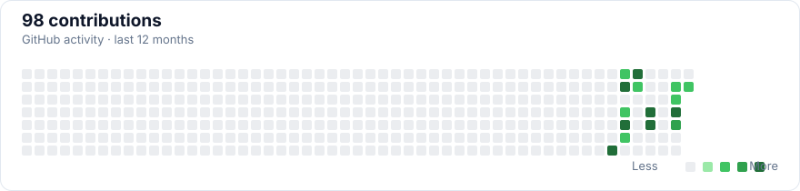

<!-- Generated from the public GitHub API by scripts/update-profile.mjs. -->

  <h1>FallAbigail</h1>
  
<a href="https://github.com/FalzzCode">@FalzzCode</a>

## Total GitHub activity

| Metric | Total |
| --- | ---: |
| Contributions | 98 |
| Commits | 93 |
| Pull requests | 1 |
| Issues | 0 |
| Reviews | 0 |

## Languages

## Account data

| Metric | Total |
| --- | ---: |
| Public code repos | 5 |
| Stars | 0 |
| Followers | 3 |
| Following | 3 |

<a href="https://github.com/FalzzCode?tab=repositories">View all repositories →</a>

