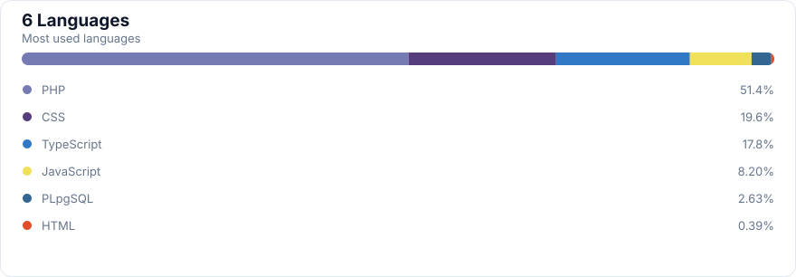

<!-- Generated from the public GitHub API by scripts/update-profile.mjs. -->

  <h1>FallAbigail</h1>
  
<a href="https://github.com/FalzzCode">@FalzzCode</a>

## Repositories

| Repository | Primary language | Stars |
| --- | --- | ---: |
| [CanteenOS](https://github.com/FalzzCode/CanteenOS) | TypeScript | 0 |
| [LibSync](https://github.com/FalzzCode/LibSync) | PHP | 0 |
| [MedikaFlow](https://github.com/FalzzCode/MedikaFlow) | PHP | 0 |
| [blindmaze-game](https://github.com/FalzzCode/blindmaze-game) | PHP | 0 |
| [fallweb](https://github.com/FalzzCode/fallweb) | HTML | 0 |

## Languages

## Account data

| Public code repos | Stars | Followers | Following |
| ---: | ---: | ---: | ---: |
| 5 | 0 | 3 | 3 |

<a href="https://github.com/FalzzCode?tab=repositories">View all repositories →</a>

